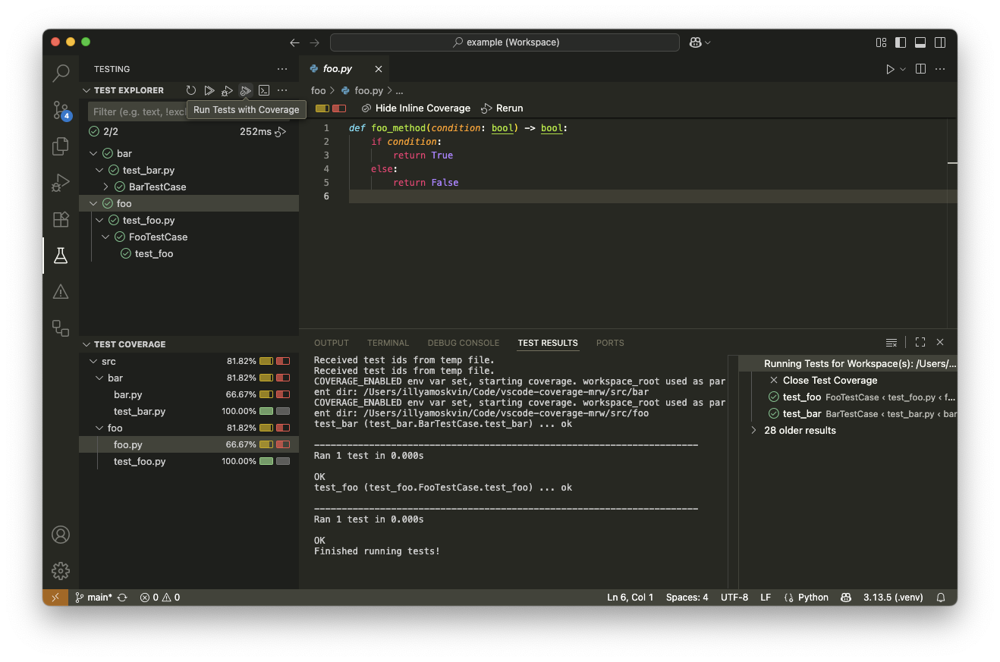
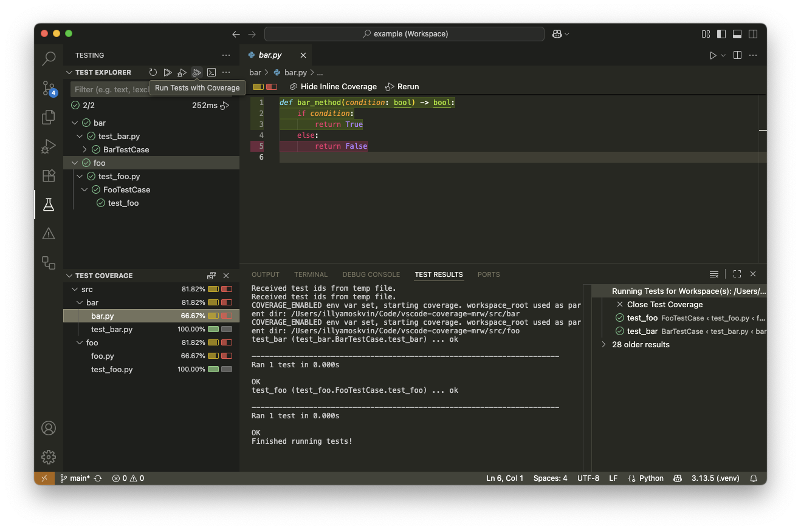
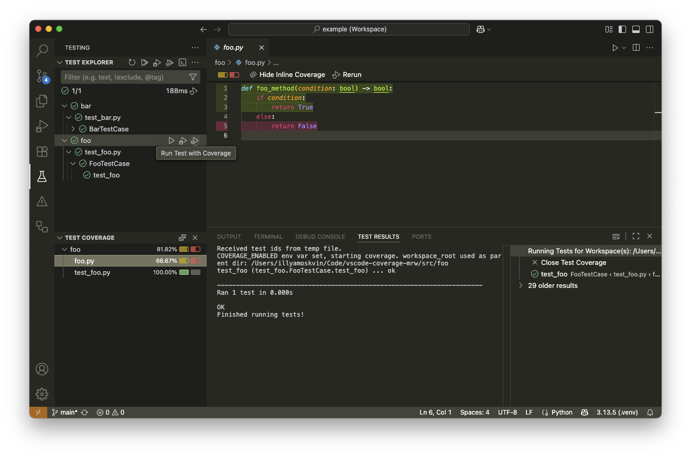

This repo illustrates a VS Code issue with coverage highlighting in multi-root workspaces.

It appears that coverage highlighting will be missing for code in some workspace folders whenever the **global "Run Tests with Coverage"** option is used.

Note how `foo.py` is missing coverage highlighting after this global test run:

During the same test run, `bar.py` has coverage highlighting:

However, if I run coverage just on the `foo` workspace folder, `foo.py` has coverage:

The expected behavior is that coverage highlighting should work correctly for all files that appear in the "Test Coverage" panel.
